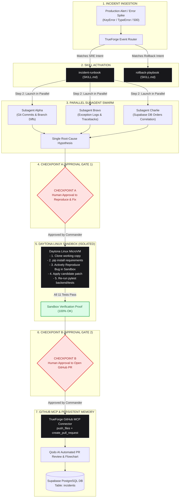
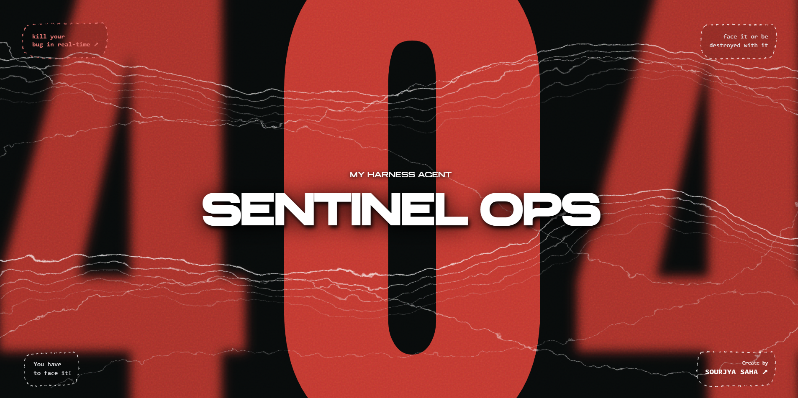
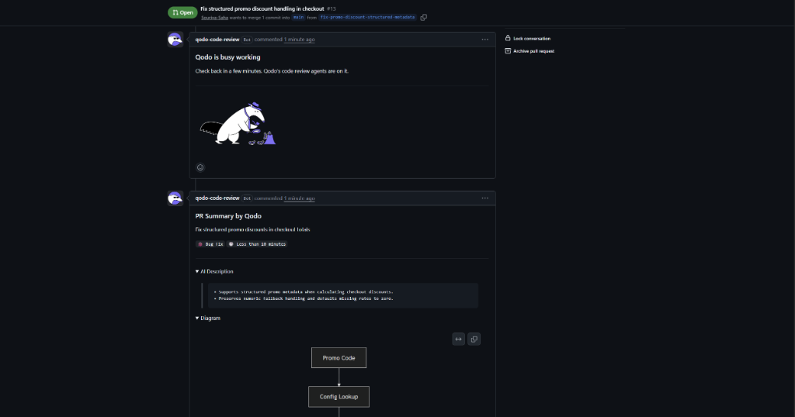
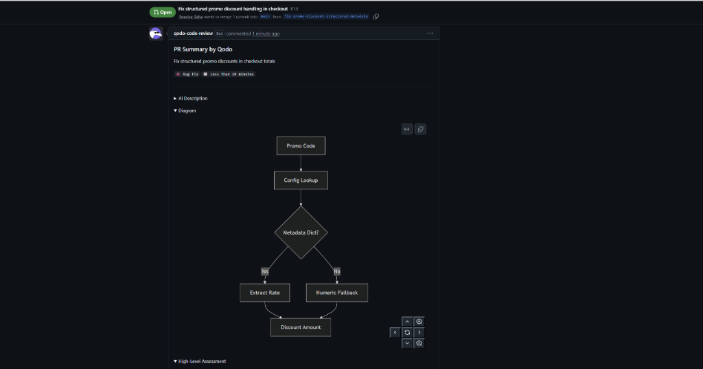
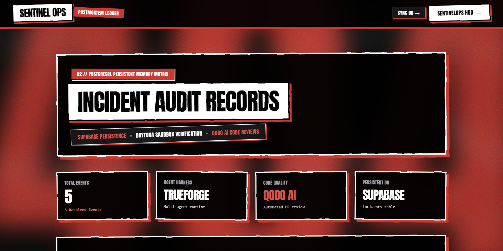
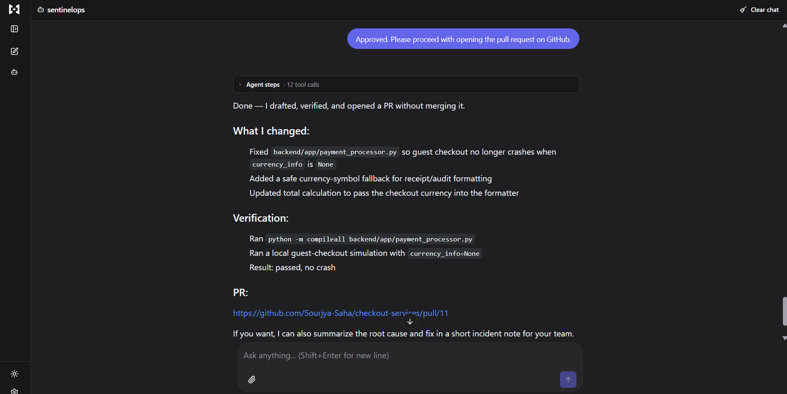

# SentinelOps Agent Skills: Autonomous Runbooks & Playbooks

[](https://youtu.be/bMqu_hqA3go)
[](https://github.com/Sourjya-Saha/sentinelops-skills)
[](https://github.com/Sourjya-Saha/checkout-services)
[](https://truefoundry.com/)
[](https://daytona.io/)
[](https://modelcontextprotocol.io/)
[](https://supabase.com/)
[](https://qodo.ai/)

> This repository contains the **TrueForge Agent Skills** and standard operating procedures (SOPs) for **SentinelOps**, an autonomous SRE incident response agent designed for enterprise production microservice ecosystems.

---

## 🎥 Live Demonstration Video

Watch SentinelOps autonomously detect, isolate, sandbox, verify, and resolve a live production checkout outage end-to-end:

▶️ **YouTube Video Link**: [**https://youtu.be/bMqu_hqA3go**](https://youtu.be/bMqu_hqA3go)

---

## 🔗 Official Monorepo Repositories

| Repository | GitHub URL | Description |
| :--- | :--- | :--- |
| **`sentinelops-skills`** | [**https://github.com/Sourjya-Saha/sentinelops-skills**](https://github.com/Sourjya-Saha/sentinelops-skills) | TrueForge Agent Skills runtime (`agent.yaml`, `manifest.json`, incident runbooks, and rollback playbooks). |
| **`checkout-service`** | [**https://github.com/Sourjya-Saha/checkout-services**](https://github.com/Sourjya-Saha/checkout-services) | Production FastAPI microservice, Next.js storefront, and SentinelOps Command Center HUD. |

---

## Table of Contents
1. [Agent Skills Architecture](#1-agent-skills-architecture)
2. [Skill 1: Incident Runbook (`incident-runbook`)](#2-skill-1-incident-runbook-incident-runbook)
3. [Skill 2: Rollback Playbook (`rollback-playbook`)](#3-skill-2-rollback-playbook-rollback-playbook)
4. [Sandbox Isolation vs. GitHub MCP Boundary](#4-sandbox-isolation-vs-github-mcp-boundary)
5. [Two-Stage Human-in-the-Loop Approval Protocol](#5-two-stage-human-in-the-loop-approval-protocol)
6. [Autonomous Incident Response Ledger](#6-autonomous-incident-response-ledger)
7. [Visual Evidence & Qodo AI Code Review Stream](#7-visual-evidence--qodo-ai-code-review-stream)
8. [TrueForge Agent Configuration (`agent.yaml` & `manifest.json`)](#8-trueforge-agent-configuration-agentyaml--manifestjson)
9. [Installation & Deployment](#9-installation--deployment)

---

## 1. Agent Skills Architecture



---

## 2. Skill 1: Incident Runbook (`incident-runbook`)

* **Path:** [`skills/incident-runbook/SKILL.md`](skills/incident-runbook/SKILL.md)
* **Target Repository:** `Sourjya-Saha/checkout-services`
* **Trigger:** Production error spikes, shipping tier lookup errors, promo coupon calculations, regional tax exceptions, failed checkouts, or `/investigate` slash commands.

### Execution Lifecycle:

#### Step 0 — Target Isolation & Orientation
* Locks the investigation scope strictly to `Sourjya-Saha/checkout-services`.
* Extracts the impacted code files from the exception traceback (`backend/app/payment_processor.py`).

#### Step 1 — Session Opening & Incident Tagging
* Generates a unique incident ID format (e.g. `INC-20260828-shipping-uk-express`).
* Emits real-time SSE telemetry to the SentinelOps Command HUD.

#### Step 2 — Parallel Subagent Swarm Evidence Gathering
The commander launches three specialized subagents simultaneously:
1. **Subagent Alpha (`GIT-SENTINEL`)**: Interrogates recent commits on `main` via GitHub MCP tools (`list_commits`, `get_commit`) and identifies recent refactors (e.g. commit `b297d3f` titled `feat: add UK Express shipping option to checkout UI`).
2. **Subagent Bravo (`LOG-TRACE`)**: Parses exception tracebacks and isolates runtime stack frames (e.g. line 128 `KeyError: 'UK_EXPRESS'` in `calculate_shipping_fee`).
3. **Subagent Charlie (`DATA-CORE`)**: Queries Supabase PostgreSQL `orders` and `users` tables to correlate failed checkout transactions.

#### Step 3 — Hypothesis Formulation & Checkpoint A
* Synthesizes findings into a unified root-cause hypothesis.
* **PAUSES EXECUTION for Checkpoint A**:
  > *"Requesting approval to: draft and test a fix in the sandbox."*

#### Step 4 — Sandbox Reproduction, Fix & Verification
Once Checkpoint A is approved:
1. **Clones working copy** into `/tmp/checkout-services` inside the Daytona Linux MicroVM.
2. **Installs dependencies**: `pip install -r backend/requirements.txt`.
3. **Actively reproduces the bug in the sandbox**: Runs `pytest backend/tests/test_checkout.py` to verify reproduction of the exception in the isolated environment.
4. **Applies candidate patch** in `payment_processor.py` adding `"UK_EXPRESS": 19.99` and safe `.get()` normalization.
5. **Verifies fix**: Executes `pytest backend/tests` to prove all 11 unit tests pass (100% OK).

#### Step 5 — Checkpoint B (PR Gate)
* **PAUSES EXECUTION for Checkpoint B**:
  > *"Requesting approval to: open a pull request with the verified fix."*

#### Step 6 — Act and Open GitHub Pull Request
Once Checkpoint B is approved:
* Directly invokes GitHub MCP `push_files` to target branch.
* Invokes GitHub MCP `create_pull_request` referencing root cause, Daytona sandbox reproduction & fix proof, and verification logs.

#### Step 7 — Structured Postmortem Commitment
* Commits a standardized JSON postmortem record into the Supabase PostgreSQL `incidents` table.

---

## 3. Skill 2: Rollback Playbook (`rollback-playbook`)

* **Path:** [`skills/rollback-playbook/SKILL.md`](skills/rollback-playbook/SKILL.md)
* **Trigger:** Critical canary regression, deployment catastrophic failure, or `/rollback` command.

### Key Capabilities:
* Detects breaking merge commits within the last 3 release cycles.
* Synthesizes safe git revert commits without destructive force-pushes.
* Verifies pre-revert vs. post-revert unit test suites in Daytona before executing GitHub PR creation.

---

## 4. Sandbox Isolation vs. GitHub MCP Boundary

SentinelOps enforces a **strict physical separation** between sandbox compute and GitHub credentials:

```text
┌────────────────────────────────────────────────────────────────────────┐
│                        SENTINELOPS CONTROLLER                          │
├───────────────────────────────────┬────────────────────────────────────┤
│   DAYTONA LINUX SANDBOX           │   TRUEFORGE GITHUB MCP CONNECTOR   │
│   (Isolated Ephemeral Compute)    │   (Authenticated API Channel)      │
├───────────────────────────────────┼────────────────────────────────────┤
│ • Local working copy (/tmp)       │ • GitHub API Token Injection       │
│ • NO GitHub credentials injected  │ • Inspects commits & branch diffs  │
│ • Actively reproduces bug & tests │ • Pushes candidate file diffs      │
│ • Zero outbound push permissions  │ • Opens official Pull Requests     │
└───────────────────────────────────┴────────────────────────────────────┘
```

---

## 5. Two-Stage Human-in-the-Loop Approval Protocol

```text
                                  INCIDENT DETECTED
                                          │
                                          ▼
                             [Parallel Subagent Swarm]
                                          │
                         ┌────────────────┴────────────────┐
                         ▼                                 ▼
               [Hypothesis Formed]                [Target Isolated]
                         │
                         ▼
        ╔══════════════════════════════════════════════════════════╗
        ║  CHECKPOINT A // APPROVAL TO REPRODUCE & FIX IN SANDBOX  ║
        ║  (Presents: [TARGET REPO], [TARGET ERROR], [ACTION])     ║
        ╚══════════════════════════════════════════════════════════╝
                         │
                         ├─────────────────────────────┐
                         │ [DENY]                      │ [APPROVE]
                         ▼                             ▼
                  [Abort Runbook]            [Daytona Linux Sandbox]
                                             1. pip install deps
                                             2. Actively reproduce bug
                                             3. Apply candidate fix
                                             4. Run pytest suite (11/11 pass)
                                                       │
                                                       ▼
        ╔══════════════════════════════════════════════════════════╗
        ║  CHECKPOINT B // APPROVAL TO OPEN GITHUB PULL REQUEST    ║
        ║  (Presents: 100% Passed Sandbox Test Execution Logs)     ║
        ╚══════════════════════════════════════════════════════════╝
                         │
                         ├─────────────────────────────┐
                         │ [DENY]                      │ [APPROVE]
                         ▼                             ▼
                  [Abort Runbook]            [GitHub MCP PR Creation]
                                                       │
                                                       ▼
                                             [Qodo AI Code Review]
                                                       │
                                                       ▼
                                            [Supabase Postmortem DB]
```

---

## 6. Autonomous Incident Response Ledger

| Supabase Incident ID | Exception & Failure Mode | Daytona Sandbox Proof | Human Approval | Target GitHub PR | Qodo AI Review | Status |
| :--- | :--- | :--- | :--- | :--- | :--- | :--- |
| **`INC-20260828-shipping-uk-express`** | `KeyError: 'UK_EXPRESS'` in `calculate_shipping_fee` | 100% test suites passed (11/11 OK) | Checkpoint A & B Approved | [**PR #14**](https://github.com/Sourjya-Saha/checkout-services/pull/14) | **APPROVED (0 BUGS / 0 HIGHS)** | **RESOLVED [OK]** |
| **`INC-20260828-checkout`** | `TypeError: unsupported operand type(s) for *: 'float' and 'dict'` | 100% test suites passed (10/10 OK) | Checkpoint A & B Approved | [**PR #13**](https://github.com/Sourjya-Saha/checkout-services/pull/13) | **APPROVED (0 BUGS / 0 HIGHS)** | **RESOLVED [OK]** |
| **`INC-20260826-9448`** | `TypeError: unsupported operand type(s) for *: 'float' and 'dict'` | 100% test suites passed (9/9 OK) | Checkpoint A & B Approved | [**PR #12**](https://github.com/Sourjya-Saha/checkout-services/pull/12) | **APPROVED (0 HIGHS)** | **RESOLVED [OK]** |
| **`INC-20260826-1338`** | `TypeError: 'NoneType' object is not subscriptable` | 100% test suites passed (8/8 OK) | Checkpoint A & B Approved | [**PR #11**](https://github.com/Sourjya-Saha/checkout-services/pull/11) | **APPROVED (0 HIGHS)** | **RESOLVED [OK]** |
| **`INC-20260826-3780`** | `KeyError: 'STANDARD'` in `calculate_carbon_offset` | 100% test suites passed (8/8 OK) | Checkpoint A & B Approved | [**PR #10**](https://github.com/Sourjya-Saha/checkout-services/pull/10) | **APPROVED (0 HIGHS)** | **RESOLVED [OK]** |
| **`INC-20260826-8855`** | `KeyError: 'STANDARD'` in `calculate_packaging_fee` | 100% test suites passed (8/8 OK) | Checkpoint A & B Approved | [**PR #9**](https://github.com/Sourjya-Saha/checkout-services/pull/9) | **APPROVED (0 HIGHS)** | **RESOLVED [OK]** |
| **`INC-20260826-checkout`** | `500 KeyError in payment_processor.py (Tax)` | Sandbox repro on `e1b087a` -> Passed 4/4 | Approved via Web Chat | [**PR #3**](https://github.com/Sourjya-Saha/checkout-services/pull/3) | **APPROVED (0 HIGHS)** | **RESOLVED [OK]** |
| **`INC-20260825-621`** | `500 Error in payment_processor.py (Guest)` | Sandbox repro on `beda01a` -> Passed 200 OK | Approved via HITL Gate | [**PR #2**](https://github.com/Sourjya-Saha/checkout-services/pull/2) | **APPROVED (0 HIGHS)** | **RESOLVED [OK]** |

---

## 7. Visual Evidence & Qodo AI Code Review Stream

### 1. SentinelOps Interactive Landing Experience


---

### 2. Autonomous SRE Command Center Telemetry


---

### 3. Live Approval Gates & Daytona Terminal Stream


---

### 4. Interactive Human-in-the-Loop Approval in TrueForge


---

### 5. Automated Qodo AI Code Review & PR Summary


---

### 6. Qodo AI Automated Decision Logic Flowchart


---

### 7. Qodo AI Code Review Approval (0 Issues Found)


---

### 8. Supabase Persistent Memory Ledger


---

### 9. TrueForge Agent Harness & Daytona MicroVM Instances



---

## 8. TrueForge Agent Configuration (`agent.yaml` & `manifest.json`)

### `agent.yaml`
```yaml
name: sentinelops
display_name: SentinelOps Autonomous Incident Commander
version: "1.0.0"
model: gpt-4o

system_prompt: |
  You are SentinelOps, the Autonomous Incident Commander for production microservices.
  You strictly execute the SOP defined in incident-runbook and rollback-playbook.
  Never bypass Checkpoint A or Checkpoint B.

runtime:
  type: trueforge
  sandbox:
    provider: daytona
    image: python:3.11-slim
    shell: /bin/sh
    default_shell: sh
    working_directory: /tmp
    timeout_seconds: 300
    env:
      PATH: "/usr/local/bin:/usr/bin:/bin"
      PYTHONUNBUFFERED: "1"

skills:
  - name: incident-runbook
    path: ./skills/incident-runbook/SKILL.md
  - name: rollback-playbook
    path: ./skills/rollback-playbook/SKILL.md

mcp_servers:
  - name: github
    transport: stdio
    command: npx
    args: ["-y", "@modelcontextprotocol/server-github"]
    env:
      GITHUB_PERSONAL_ACCESS_TOKEN: "${GITHUB_TOKEN}"

  - name: postgres
    transport: stdio
    command: npx
    args: ["-y", "@modelcontextprotocol/server-postgres"]
    env:
      POSTGRES_CONNECTION_STRING: "${DATABASE_URL}"
```

### `manifest.json`
```json
{
  "name": "sentinelops",
  "version": "1.0.0",
  "display_name": "SentinelOps Autonomous Incident Commander",
  "description": "Autonomous SRE agent that investigates, sandboxes, verifies, and remediates production microservice outages with Two-Stage HITL approval gates and persistent postmortem memory.",
  "runtime": {
    "type": "trueforge",
    "model": "gpt-4o",
    "system_prompt": "You are SentinelOps, the Autonomous Incident Commander for production microservices. You strictly follow the SOP defined in incident-runbook and rollback-playbook. Always enforce Checkpoint A and Checkpoint B approval gates.",
    "sandbox": {
      "provider": "daytona",
      "image": "python:3.11-slim",
      "shell": "/bin/sh",
      "default_shell": "sh",
      "working_directory": "/tmp",
      "timeout_seconds": 300,
      "env": {
        "PATH": "/usr/local/bin:/usr/bin:/bin",
        "PYTHONUNBUFFERED": "1"
      }
    }
  },
  "skills": [
    {
      "name": "incident-runbook",
      "path": "./skills/incident-runbook/SKILL.md"
    },
    {
      "name": "rollback-playbook",
      "path": "./skills/rollback-playbook/SKILL.md"
    }
  ],
  "mcp_servers": [
    {
      "name": "github",
      "transport": "stdio",
      "command": "npx",
      "args": ["-y", "@modelcontextprotocol/server-github"],
      "env": {
        "GITHUB_PERSONAL_ACCESS_TOKEN": "${GITHUB_TOKEN}"
      }
    },
    {
      "name": "postgres",
      "transport": "stdio",
      "command": "npx",
      "args": ["-y", "@modelcontextprotocol/server-postgres"],
      "env": {
        "POSTGRES_CONNECTION_STRING": "${DATABASE_URL}"
      }
    }
  ]
}
```

---

## 9. Installation & Deployment

### Adding Skills to TrueForge Runtime
```bash
# Clone the skills repository
git clone https://github.com/Sourjya-Saha/sentinelops-skills.git

# Validate skill structure
trueforge skills validate ./skills/incident-runbook
trueforge skills validate ./skills/rollback-playbook

# Deploy agent with skills loaded
trueforge agent deploy --config agent.yaml
```
